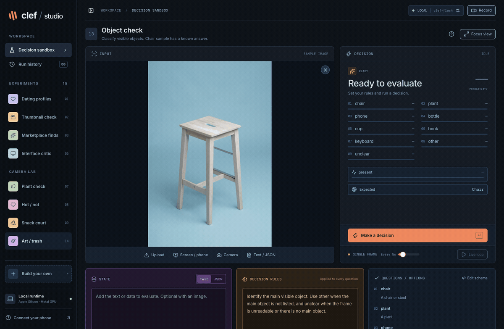

# Clef Studio

A local playground for Clef decision models on Apple Silicon. Give it text, JSON or an image, set your rules, and see how it scores the options. Webcam and screen sharing work too.

[](docs/images/studio.png)

## Run it

You'll need an Apple Silicon Mac, Node 22.12+ (24 recommended), npm and [uv](https://docs.astral.sh/uv/getting-started/installation/). The model download is about 18 GB, plus space for dependencies. We've used it on an M3 Max with 36 GB of unified memory.

```sh
npm ci
uv python install 3.12
npm run model:download
```

The download resumes if interrupted. Once it's ready, start two terminals:

```sh
# Terminal 1: UI and API
npm run dev
```

```sh
# Terminal 2: local model runtime
npm run model
```

Open [localhost:5173](http://127.0.0.1:5173), wait for the runtime indicator to turn green, then make a decision. You can work on the UI while the model downloads.

## Try it

Start with Color check or Object check for a sample with a known answer. Other experiments cover app design, plants, dating profiles, art and more. Build your own lets you define the questions from scratch.

State holds the input. Decision rules hold your preferences or rubric. The question schema sets the choices, yes/no questions or scores you want back. Inspect response shows probabilities and timing; Clef doesn't write a prose explanation.

Drop several images to work through a queue, or connect a camera or shared window. The preview freezes on the submitted frame during scoring. Focus view, portrait layout and recording are there for demos.

For Android dating profiles, accessibility capture can read the expanded profile and collect all photos in one pass. Read + decide scores them, with per-photo results and a combined score. See the [phone guide](docs/phone-capture.md) for setup, iPhone capture and image OCR.

History, queues and settings stay in browser memory. Export runs you want to keep before refreshing.

## More details

- [Usage guide](docs/usage.md): experiments, schemas, media, queues and shortcuts.
- [Runtime setup](docs/runtime.md): troubleshooting, ports and the optional Cloudflare engine.
- [Q8 benchmark](docs/benchmarks/m3-max.md): on this M3 Max, Q8 used less memory but ran slower than the default bf16 runtime. It's available for benchmarking, not as a UI engine yet.
- [Contributing](CONTRIBUTING.md): development checks and where the code lives.

Local inference is the default. Choosing Cloudflare sends the current input to its API; credentials stay on the server.

Application code is [MIT licensed](LICENSE). The model and other assets keep their [upstream licenses](THIRD_PARTY_NOTICES.md). This is an independent project.
