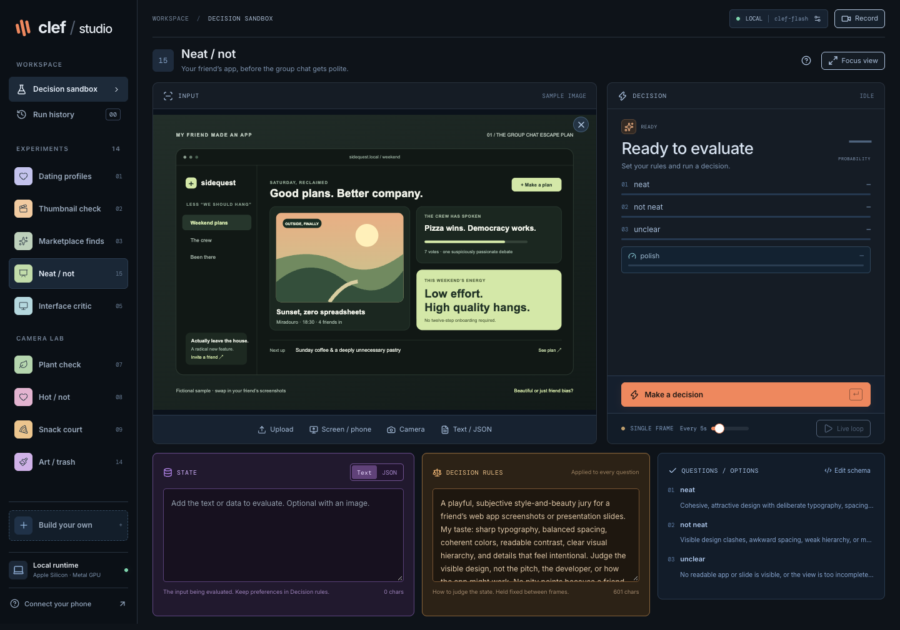

# Clef Studio

A local sandbox for Clef decision models. Try text, JSON, images, videos, webcam input and screen sharing; define your own rules and inspect the probabilities behind each decision.



## Quick start

Requires **Node 22.12+** (Node 24 recommended), npm, [uv](https://docs.astral.sh/uv/getting-started/installation/) and an Apple Silicon Mac for local inference. The runtime uses Python 3.12, PyTorch MPS, bfloat16 and eager attention. It has been exercised on an M3 Max with 36 GB of unified memory. The model download is approximately **18 GB**, with additional memory and disk needed for inference and dependencies.

From the repository directory:

```sh
npm ci
uv python install 3.12
npm run model:download
```

The download uses a pinned official model revision and resumes existing downloads. Then start these in separate terminals:

```sh
# Terminal 1: UI and API
npm run dev
```

```sh
# Terminal 2: local model runtime
npm run model
```

Open **[http://127.0.0.1:5173](http://127.0.0.1:5173)**. Wait for the local runtime indicator to turn green, select an experiment, and click **Make a decision**. You can develop the UI while the model downloads; inference becomes available when the runtime is ready.

| Service | Address |
| --- | --- |
| Development UI | `http://127.0.0.1:5173` |
| API | `http://127.0.0.1:3001` |
| Model health | `http://127.0.0.1:8001/health` |

All services bind to localhost. Model weights are stored in `.models/clef-flash`; the Python environment is in `runtime/.venv`, with uv’s cache in `.uv-cache`. These directories are ignored by Git.

## Using the sandbox

**State** is the text or parsed JSON to evaluate. **Decision rules** contain your preferences or rubric and are appended to every question’s instructions. Images are optional and can be combined with state. The **Questions / options** schema defines the outputs:

| Question type | Output |
| --- | --- |
| `choice` | One named option, confidence and probabilities across options |
| `noul` | A yes probability between 0 and 1 |
| `score` | A score over an ordered rubric, with probabilities for its levels |

The schema editor highlights JSON, validates it and shows a live preview. **Inspect response** exposes the actual structured response, token usage, latency, GPU inference time and image-processing metadata. Clef does not generate a prose explanation. Visual verdicts use the supplied rubric; their probabilities are model outputs, not measured real-world accuracy.

### Experiments

| Experiment | Try it with |
| --- | --- |
| Dating profiles | Profile images plus explicit preferences and profile details |
| Thumbnail check | Cover images and video frames |
| Marketplace finds | Listing photos, prices and requirements |
| Neat / not | A friend’s app screenshots or slides; judges style, beauty and polish |
| Interface critic | Screenshots with clipping, overlap or readability issues |
| Plant check | Visible leaf condition and a tentative next action |
| Hot / not | A subjective attraction rubric for adults or adult fictional characters |
| Snack court | Food photos and deliberately opinionated party rules |
| Art / trash | Artwork and your own aesthetic taste |
| Desk verdict | Desk organization, judged from visible objects |
| Presentation | Visible styling and presentation, without inferring gender identity |
| Color check | Known color swatches with an expected answer |
| Object check | Object categories; the chair sample has an expected answer |
| Build your own | Arbitrary text, JSON or images with editable questions and rules |

### Images, video and live capture

Upload or drop JPEG, PNG or WebP images (up to 20 MB each). Browser-side normalization caps the longest edge at 1,280 pixels; the local processor uses a 262,144-pixel budget, typically no more than 256 vision tokens per image.

Choose **Camera** for a webcam or **Screen / phone** to share a window or screen. To use a phone, mirror it to your Mac and share the mirroring window. Video uploads are evaluated one frame at a time; upload a video on its own. Codec support depends on the browser.

During processing, the preview displays the exact submitted frame, holds it for one second after completion, then resumes. Uploaded video pauses during processing and retains its prior playing or paused state. The live loop schedules its next capture after the current inference finishes.

### Phone capture on Android and iPhone

Open **Connect your phone** (or the **Phone setup** button) for the platform guide. Its **Share phone window** button opens the browser’s capture picker directly.

**Android:** use [scrcpy](https://github.com/Genymobile/scrcpy) to mirror the phone over USB. It works on macOS without root access or a permanent app installation on the phone. Install the Mac tools once:

```sh
brew install scrcpy
brew install --cask android-platform-tools
```

On the phone, find **Build number** in Settings → About phone (sometimes under Software information), tap it seven times, then enable **USB debugging** in Developer options. Connect a data-capable USB cable, unlock the phone and accept its debugging authorization prompt. Launch the mirror:

```sh
scrcpy --select-usb --no-audio --max-size=1280 --window-title="Android phone"
```

In the studio’s sharing picker, select the **Android phone** window. The 1,280-pixel limit preserves aspect ratio and avoids streaming unnecessarily large frames. You can interact with the phone through the scrcpy window while the studio samples it.

If no device appears, run `adb devices`: `device` means authorized; `unauthorized` means accept the prompt on the phone. An empty list usually means USB debugging is disabled or the cable does not carry data. With multiple USB devices, use `scrcpy --serial=YOUR_DEVICE_SERIAL` instead of `--select-usb`. See the official [macOS setup](https://github.com/Genymobile/scrcpy/blob/master/doc/macos.md), [connection guide](https://github.com/Genymobile/scrcpy/blob/master/doc/connection.md) and [Android developer-options instructions](https://developer.android.com/studio/debug/dev-options).

On Samsung devices, if USB debugging says **blocked by Auto Blocker**, open Settings → Security and privacy → Auto Blocker and turn it off for the session. Then enable USB debugging, reconnect and authorize the Mac. You can restore Auto Blocker afterward. This behavior is documented by [Samsung](https://docs.samsungknox.com/admin/fundamentals/whitepaper/samsung-knox-mobile-security/system-security/samsung-auto-blocker/).

**iPhone:** connect and unlock the phone, accept **Trust This Computer**, then open QuickTime Player → File → New Movie Recording. Select the iPhone from the camera menu beside Record, leave the preview open and share that QuickTime window. You do not need to start a recording.

### Android profile capture

With one authorized Android phone connected, Dating profiles selects **Android accessibility** automatically, including after reconnecting. Click the source label to choose a device or explicitly switch to **Image OCR**. Full-profile mode uses the phone’s native accessibility tree for text and ADB screenshots for photos. Screen sharing through scrcpy remains useful for the live preview.

- **Immediate** reads the currently visible profile and captures one photo.
- **Full profile** captures each photo, opens the expanded profile and scrolls until its sections have been collected. It fills State with written name/age, distance, photo count, bio, interests, labelled attributes and prompt answers. Missing details remain empty; app navigation and report/block controls are excluded.
- **Read text** collects without inference. **Read + decide** collects and scores every photo. After reading, **Score all photos** evaluates the captured queue without collecting again.

The native bridge uses [uiautomator2](https://github.com/openatx/uiautomator2), installed with the runtime dependencies. On its first read it starts the bundled accessibility helper on the phone over authorized ADB. Subsequent reads reuse the connection; the Mac helper exits with the API. Keep the phone unlocked with the current profile open. This path does not invoke OCR.

State updates while collecting, with visible progress and captured thumbnails. **Cancel phone capture** interrupts the active phone command. Photos and their scores share a compact gallery beside the full-height media preview. Click a photo to review its result; **Return to live preview** restores the connected stream without another sharing prompt. Both the main sidebar and profile rail can collapse.

The combined attraction score is the median of all completed photo scores, normalized to 0–100. It appears only after every photo has completed; per-photo answers and combined score also appear in State. Derived scores are excluded from later model inputs so previous decisions do not influence the next photo.

**Reset profile** clears collected State, photos and scores while keeping your rules. **Read next profile** reads the profile currently open on the phone. When the written name or age changes, a **New profile** indicator appears without replacing State. This detection does not advance or match a profile on the phone.

### Image profile text capture

For uploaded screenshots or an iPhone/screen-share frame, explicitly choose **Image OCR**. This uses Apple Vision locally, independently of Clef. Build its helper once (requires the Xcode Command Line Tools):

```sh
npm run ocr:build
```

**Read profile text** prefills State from written text. Name and age anchor the profile region; app headers and navigation are excluded. **Inspect text** shows the retained and excluded text. Unlabelled details remain unclassified rather than being guessed from the portrait. Live preview resumes automatically after reading.

**OCR · refresh each decision** synchronizes recognized text with the evaluated frame. Editing State or its format disables automatic replacement. Failed or empty recognition reports an error instead of reusing old text. Run `npm run test:ocr` to verify the actual native helper with a known text image. Captured profiles remain in browser memory; the API does not save them to the repository.

### Image queues

Select or drop multiple images to create a queue of up to 100 normalized images per experiment. Browse thumbnails or previous/next, evaluate one image, or use **Run queue** for sequential processing. **Pause** finishes the current image and leaves the rest pending. Completed images retain their results when revisited.

Changing state, rules or the schema clears cached queue results and pauses processing; earlier runs remain in history with their filenames. A failed image stops the batch for an explicit retry. Switching experiments retains their individual queues.

### History and recording

Run history, queues and settings live in browser memory and reset on refresh. Export run history as JSON, download result cards, or record a session from the toolbar. Focus view and the portrait layout are useful for screen recordings.

| Shortcut | Action |
| --- | --- |
| Enter | Run a decision when not editing text |
| F | Toggle focus view |
| Escape | Leave focus view and pause the live loop |

## Q8 benchmark

The [M3 Max comparison](docs/benchmarks/m3-max.md) includes paired probabilities, per-fixture timing and reproducible commands. On this Mac, warm median inference was **1.77 s** for PyTorch bf16 and **2.02 s** for MLX Q8; Q8 used **9.94 GiB** of active GPU allocations versus **17.75 GiB**. All 35 paired top answers agreed in the small fixture suite. Q8 reduced memory but was slower here.

```sh
npm run model:download:q8
```

This downloads the pinned community MLX build for benchmarking. The studio’s production local runtime currently uses the official PyTorch bf16 model; Q8 is not an engine setting yet.

## Optional Cloudflare engine

Local inference is the default. To enable the remote engine:

```sh
cp .env.example .env
```

Set `CLOUDFLARE_ACCOUNT_ID` and `CLOUDFLARE_AUTH_TOKEN`, restart the API and select **Cloudflare** in engine settings. That selection sends the current state, instructions and images to Cloudflare. Credentials stay in the server environment. There is no automatic remote or CPU fallback.

## Troubleshooting

| Symptom | Check |
| --- | --- |
| Local runtime offline | Start `npm run model`; inspect its terminal output and `/health`. |
| Weights missing | Finish `npm run model:download`, then restart the model runtime. |
| MPS unavailable | Local inference requires an Apple Silicon Mac with working PyTorch MPS support. |
| First run is much slower | GPU warm-up can make the first inference substantially slower. Image content, input shape and schema size also affect latency. Inspect response separates GPU inference time from overall request time. |
| Another decision is running | The GPU processes one request at a time. The UI shows the active experiment, including requests from other tabs. |
| Camera or screen capture fails | Check browser and macOS permissions; use Chrome on localhost for screen sharing. |
| Port already in use | Stop the process occupying 5173, 3001 or 8001 before starting the corresponding service. |

Local runtime requests are limited to 4,096 tokens. Keep state and question schemas reasonably small. The API times out inference requests after three minutes; an active GPU job may continue until the runtime finishes.

## Development and checks

```sh
npm run lint
npm run build
npm test
```

Browser tests require Google Chrome. Playwright starts the development server automatically, or reuses an existing one outside CI. Tests substitute inference responses and capture streams to exercise UI behavior without GPU inference. API schema validation is tested separately. GitHub Actions runs lint, build and tests without downloading model weights.

Individual checks:

```sh
npm run test:server
npm run test:ui
# Requires downloaded model files; exercises the actual processor without loading weights:
npm run test:processor
```

To serve the built UI locally, run `npm run build`, then `npm run server` and `npm run model` in separate terminals. The built UI is served at `http://127.0.0.1:3001`.

### Repository layout

```text
src/                    React UI, experiments, schemas and media helpers
src/components/ui/      Components installed with the shadcn CLI
server/                 Express API, provider routing and response validation
runtime/                Python MPS runtime, downloader and processor regression test
public/samples/         Demo images and SVG fixtures
tests/                  Playwright browser regression tests
benchmarks/             Paired PyTorch / MLX quantization comparison
docs/                   README screenshot and benchmark results
.github/workflows/      GitHub checks
```

See [CONTRIBUTING.md](CONTRIBUTING.md) for adding experiments and making changes.

## Model and licenses

The official [Cloudflare/clef-flash](https://huggingface.co/Cloudflare/clef-flash) model is pinned to revision `17f0b0ad64efb65d273590632833508766b2aae6`. The runtime uses its published schema inference code, with MPS and image-budget configuration for this local sandbox. This is an independent project.

Application code is licensed under [MIT](LICENSE). Model weights, sample photographs, fonts and other dependencies retain their upstream licenses; see [THIRD_PARTY_NOTICES.md](THIRD_PARTY_NOTICES.md).
